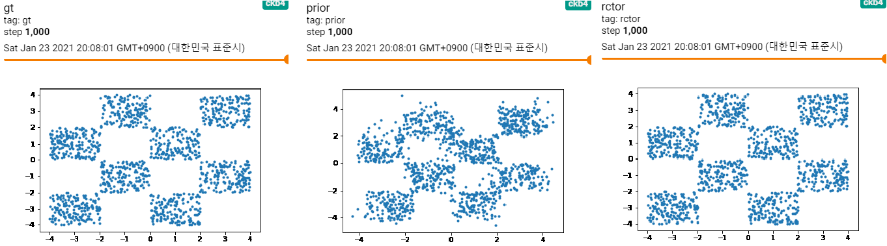
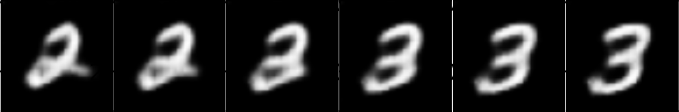

# tf-survae-flows

(Unofficial) Tensorflow implementation of SurVAE Flows, Nielsen et al., 2020. 

- Original paper, SurVAE Flows [[arXiv:2007.02731](https://arxiv.org/abs/2007.02731)]
- Full code is based on original repository [[GIT](https://github.com/didriknielsen/survae_flows)]

## Usage

For checking exeperiments, reference experiment page.

- [WIP] [experiments/checkerboard.ipynb](./experiments/checkerboard.ipynb), checkerboard toy samples for AbsFlow.
- [experiments/vae.ipynb](./experiments/vae.ipynb), MNIST samples for VAE.

Checkerboard baseline

[WIP] Checkerboard AbsFlow

MNIST-VAE on survae-flow framework

